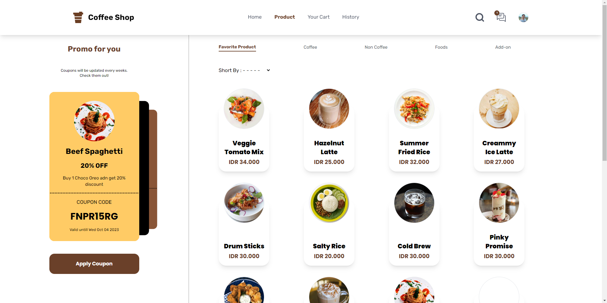

  

  <h2 align="center">Coffee Shop</h2>

  

    <a href="https://coffeeshop-react.vercel.app/">View Demo</a>
    ·
    <a href="mailto:4fifbuchori@gmail.com">Report Bug</a>
    ·
    <a href="mailto:4fifbuchori@gmail.com">Request Feature</a>
  

## Coffee Shop

Coffee Shop is a web-based application for order coffee, non coffee, and foods product.

## Build With

This application is built using React.js, Redux, axios, TailwindCSS.

  

## Features

Coffee Shop has several main features:

- Create account
- Search for products
- Multi product in cart
- Order product
- Transaction history
- Edit profile

## How to run the application

To run the application, follow these steps:

1. Clone this repository to your computer.
2. Open a terminal in the repository directory and run the `npm install` command to install all required dependencies.
3. After it finishes, run the `npm start` command to run the application.
4. Open a browser and visit `http://localhost:3000` to see the application.

## Contributions

If you would like to contribute to this project, please send a pull request to this repository. We greatly appreciate your contributions.

## Documentation

  
  
  
  
  
  

